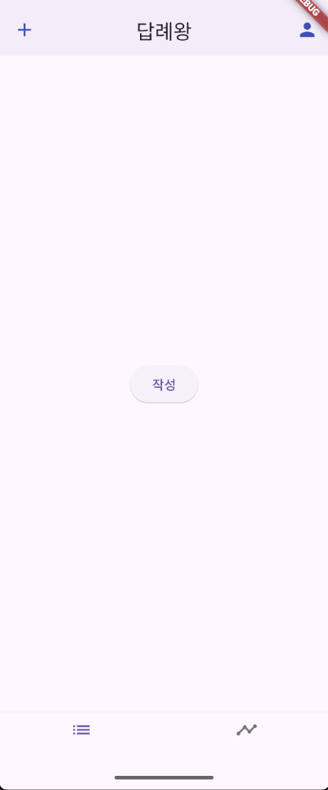
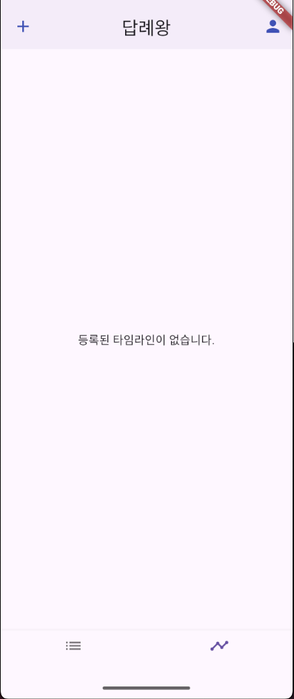
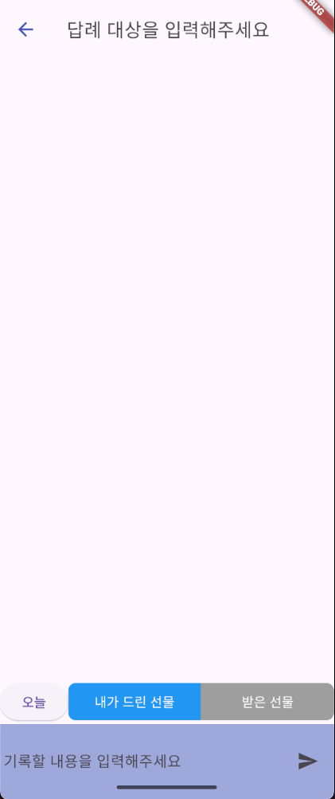
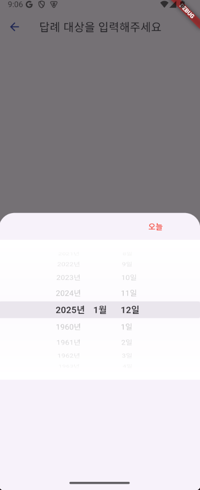
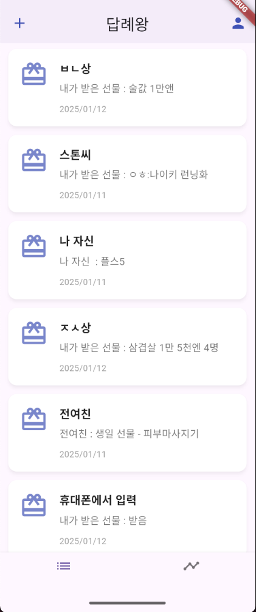
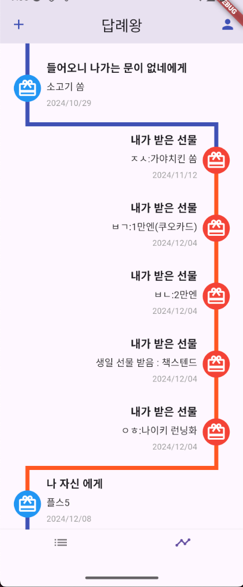
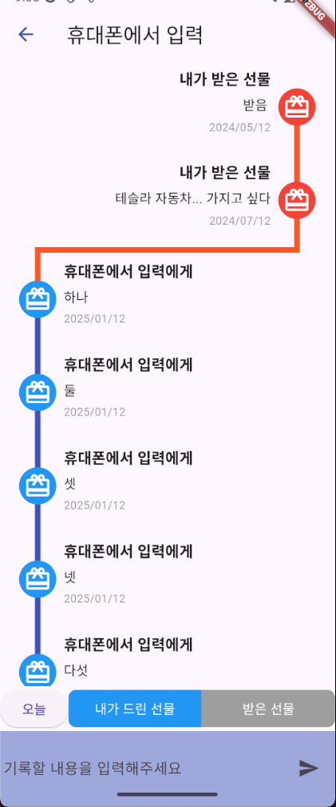

# 답례왕

## 프로젝트 소개

- 세상에 완벽한 공짜는 없다 되돌려 줘야 다시 돌아오고 그게 바로 인생.. 인건지 저도 잘 모르겠습니다..?
- 받은 선물을 기록하고 답례 내용을 등록합니다.
- 먼저 배풀 수도 있는 것이니 준 선물도 역시 등록이 가능합니다.
- 경조사의 출입금에 대해서도 관리되도록 할 생각입니다.

<br>


## 앱 이미지
<div align="center">

| **로그인 화면** | **빈 룸 리스트 화면** | **빈 타임라인 리스트 화면** |
|------------------|-----------------------|-----------------------------|
|  |  |  |
| 구글 계정 로그인이 가능하도록 작업 | 데이터가 없을 때 초기 표시(룸 탭) | 데이터가 없을 때 타임라인 탭 표시 |

| **새로운 룸 생성 화면** | **날짜 선택 화면** | **로그아웃 화면** |
|-------------------------|-------------------|-------------------|
|  |  |  |
| 좌측 상단의 + 버튼 혹은 데이터가<br> 없을 때 룸 탭에서 작성 버튼을<br> 눌렀을 때 이동되는 화면 | 오늘 버튼을 누르면 날짜를<br> 고를 수 있는 date picker가<br> 표시 됨 | 메인화면 우측상단의 사람 모양을<br> 누르면 보이는 화면 |

| **룸 리스트 화면** | **타임라인 리스트 화면** | **현재 룸 상세 화면** |
|--------------------|-------------------------|----------------------|
|  |  |  |
| 룸이 존재할 때 표시 | 타임라인이 존재할 때 표시<br>(타임라인은 룸과 상관없이<br>모든 타임라인을 표시) | 정보가 등록된 룸의 상세화면 |
</div>

<br>

## 팀원 구성

<div align="center">

| **조한규** |
| :------: |
| [ <br/> @hangyuCho](https://github.com/hangyuCho) | 

</div>

<br>

## 1. 개발 환경

- Front : Flutter
- Back-end : -
- 버전 및 이슈관리 : Github, Github Issues, Github Project
- 협업 툴 : Discord
- 서비스 배포 환경 : -
- 디자인 : -

| **라이브러리 이름**      | **현재 버전** | **설명**                          |
|--------------------------|---------------|------------------------------------|
| flutter_riverpod         | 2.3.0         | 상태 관리를 위한 Riverpod         |
| state_notifier           | 0.7.0         | 상태 관리용 기본 패키지           |
| firebase_core            | 2.15.0        | Firebase 초기화                   |
| firebase_auth            | 4.7.0         | Firebase 인증                     |
| cloud_firestore          | 5.10.0        | Firestore 데이터베이스             |
| google_fonts             | 4.1.0         | Google 폰트 사용                  |
| intl                     | 0.18.0        | 날짜 및 숫자 포맷팅               |
| timeline_tile            | 2.0.0         | 타임라인 레이아웃 구성            |
| shared_preferences       | 2.3.0         | 로컬 데이터 저장                  |
| http                     | 1.2.0         | HTTP 요청 처리                    |
| flutter_test             | SDK 포함      | Flutter 테스트 도구               |
| integration_test         | SDK 포함      | Flutter 통합 테스트               |
<br>

Doctor summary (to see all details, run flutter doctor -v):<br>
[✓] Flutter (Channel stable, 3.27.1, on macOS 15.1.1 24B91 darwin-arm64, locale ko-JP)<br>
[✓] Android toolchain - develop for Android devices (Android SDK version 33.0.1)<br>
[✓] Xcode - develop for iOS and macOS (Xcode 15.2)<br>
[✓] Chrome - develop for the web<br>
[✓] Android Studio (version 2021.1)<br>
[✓] Android Studio (version 2023.1)<br>
[✓] IntelliJ IDEA Community Edition (version 2022.1.2)<br>
[✓] IntelliJ IDEA Ultimate Edition (version 2023.2.5)<br>
[✓] IntelliJ IDEA Community Edition (version 2023.2.5)<br>
[✓] VS Code (version 1.96.2)<br>
[✓] Connected device (4 available)<br>
[✓] Network resources<br>
<br>

## 2. 브랜치 전략

### 브랜치 전략
- Git-flow 전략을 기반으로 main, develop 브랜치와 feature 보조 브랜치를 운용했습니다.
- main, develop, Feat 브랜치로 나누어 개발을 하였습니다.
    - **main** 브랜치는 배포 단계에서만 사용하는 브랜치입니다.
    - **develop** 브랜치는 개발 단계에서 git-flow의 master 역할을 하는 브랜치입니다.
    - **Feat** 브랜치는 기능 단위로 독립적인 개발 환경을 위하여 사용하고 merge 후 각 브랜치를 삭제해주었습니다.

<br>

## 3. 프로젝트 구조

```
 ┣ 📂features
 ┃    ┣ 📂home
 ┃    ┣ 📂login
 ┃    ┣ 📂timeline
 ┃    ┣ 📂room
 ┃         ┣ 📂domain
 ┃         ┃    ┣ 📂enums
 ┃         ┃    ┣ 📂models
 ┃         ┃    ┃    ┣ 📂generated # 자동생성 클래스를 위한 경로
 ┃         ┃    ┃    ┗ 📜room.dart # 모델 정의
 ┃         ┃    ┣ 📂providers
 ┃         ┃    ┃    ┣ 📂notifiers # notifier만 정리하는 부분
 ┃         ┃    ┃    ┃    ┣ 📜room_list_notifier.dart
 ┃         ┃    ┃    ┃    ┗ 📜room_notifier.dart
 ┃         ┃    ┃    ┗ 📜room_providers.dart # room별 provider가 정리되는 부분
 ┃         ┃    ┣ 📂repositories # 디비 관련 로직()
 ┃         ┃    ┃    ┣ 📜firebase_room_repository.dart # 데이터베이스 별로 정의가 달라질 것
 ┃         ┃    ┃    ┗ 📜i_room_repository.dart
 ┃         ┃    ┗ 📂usecases
 ┃         ┃    ┃    ┣ 📂add_room # 
 ┃         ┃    ┃    ┃    ┣ 📜add_room_command.dart # 파라미터를 넘길 때 사용하는 클래스(저장 로직은 command)
 ┃         ┃    ┃    ┃    ┣ 📜add_room_response.dart
 ┃         ┃    ┃    ┃    ┗ 📜add_room_usecase.dart # 상세로직 메소드는 클래스당 1개만 존재
 ┃         ┃    ┃    ┣ 📂fetch_all_room
 ┃         ┃    ┃    ┗ 📂fetch_room_by_id
 ┃         ┃    ┃    ┃    ┣ 📜fetch_room_by_id_query.dart # 파라미터를 넘길 때 사용하는 클래스(취득 로직은 query)
 ┃         ┃    ┃    ┃    ┣ 📜fetch_room_by_id_response.dart
 ┃         ┃    ┃    ┃    ┗ 📜fetch_room_by_id_usecase.dart
 ┃         ┗ 📂presentation
 ┃              ┣ 📂atoms
 ┃              ┃    ┣ 📂buttons
 ┃              ┃    ┃    ┣ 📜basic_button.dart
 ┃              ┃    ┃    ┣ 📜go_back_button.dart
 ┃              ┃    ┃    ┣ 📜plus_button.dart
 ┃              ┃    ┃    ┗ 📜send_button.dart
 ┃              ┃    ┣ 📂inputs
 ┃              ┃    ┃    ┣ 📜color_radio.dart
 ┃              ┃    ┃    ┣ 📜text_input.dart
 ┃              ┃    ┃    ┗ 📜textarea_input.dart
 ┃              ┃    ┗ 📂labels
 ┃              ┃    ┃    ┣ 📜info_label.dart
 ┃              ┃    ┃    ┗ 📜text_label.dart
 ┃              ┣ 📂molecules
 ┃              ┃    ┗ 📜room_card.dart
 ┃              ┣ 📂organisms
 ┃              ┃    ┗ 📜room_list.dart
 ┃              ┣ 📂pages
 ┃              ┃    ┣ 📜room_detail_page.dart
 ┃              ┃    ┗ 📜room_list_page.dart
 ┃              ┣ 📂templates
 ┃                   ┣ 📜room_detail_template.dart
 ┃                   ┗ 📜room_list_template.dart
 ┃              
 ┣ 📂shared # 공통 부분
 ┃    ┣ 📂presentation
 ┃    ┃    ┣ 📂atoms
 ┃    ┃    ┃    ┗ 📜avatar.dart
 ┃    ┃    ┗ 📂organisms
 ┃    ┃    ┃    ┗ 📜form_popup.dart
 ┃    ┣ 📂providers
 ┃    ┃    ┣ 📜README.md
 ┃    ┃    ┗ 📜providers.dart
 ┃    ┣ 📂usecases
 ┃    ┃    ┣ 📜command.dart
 ┃    ┃    ┣ 📜response.dart
 ┃    ┃    ┗ 📜usecase.dart
 ┃    ┣ 📜constants.dart
 ┃    ┣ 📜error_handling.dart
 ┃    ┣ 📜result.dart
 ┃    ┗ 📜utils.dart
 ┣ 📜README.md
 ┗ 📜main.dart # 앱 진입점
```

<br>

> https://atomicdesign.bradfrost.com/chapter-2/?source=post_page-----2bb4d9ca5f97--------------------------------
> https://zenn.dev/nagakuta/articles/25c8aaf7744830bdab3d
> 참고 자료
- Atomic Design
  - 목적
    - 작은 UI 컴포넌트를 결합하여 더 큰 컴포넌트를 만드는데 사용되는 구조
  - 구성요소
    - atoms(원자)
      - 설명 : 구성 요소의 최소 단위
      - 책임 : 디자인 통일성
    - molecules(분자)
      - 설명 : 
        - 기능을 결합하여 사용자의 구체적인 동기에 대응
        - 2개 이상의 atoms를 결합해서 구현
        - ※ 독립해서 존재할 수 없고, 다른 컨포넌트의 기능을 보조하는 역할이 강한 컨포넌트
        - ※ 상태(State)를 직접 변경하지 않음
      - 책임 : 행동을 방해하지 않는 조작성
    - organisms(유기체)
      - 설명 : 
        - 구성 요소로 완결되는 컨텐츠 제공
        - ※ 독립해서 존재할 수 있음
        - ※ 상태(State)를 직접 변경가능
      - 책임 : 사용자의 행동을 유도하는 컨텐츠
    - templates
      - 설명 : 
        - 구성 요소가 페이지에 올바르게 배치 되었는지 확인
        - 상위층의 레이어에 크기나 표시 위치의 결정권을 맡김
      - 책임 : 화면 전체 레이아웃
    - pages
      - 설명 : 화면 전환
      - 책임 : 템플릿(라우터) 전환

<br>

# **StateProvider vs StateNotifierProvider**

| **특성**             | **StateProvider**                           | **StateNotifierProvider**                     |
|----------------------|---------------------------------------------|-----------------------------------------------|
| **사용 난이도**      | 쉬움                                        | 중간                                          |
| **로직 캡슐화**      | 없음 (직접 상태를 조작)                     | 있음 (상태 변경은 메서드를 통해 처리)         |
| **상태 변경 방식**   | `state` 속성을 직접 변경                     | `StateNotifier`의 메서드를 호출               |
| **적합한 상태**      | 단순 데이터 (숫자, 문자열, boolean 등)       | 복잡한 데이터 구조 (객체, 리스트 등)          |
| **적합한 로직**      | 로직이 거의 없는 경우                       | 비동기 작업, 상태 검증 등 복잡한 로직         |
| **예시**             | UI 토글 상태                                | To-Do 리스트 추가/수정/삭제, API 연동 상태 관리 |
| **사용 사례**        | 단순 데이터 관리 (카운터, 토글 등)           | Firestore 연동, 비동기 데이터 관리            |

---

## **선택 기준**
1. **단순한 상태 관리**:
   - `StateProvider`를 사용.
   - 예: 스위치 토글, 숫자 카운터.

2. **복잡한 상태 관리**:
   - `StateNotifierProvider`를 사용.
   - 예: Firestore 데이터 동기화, 상태가 여러 필드로 구성된 객체.

---

## **프로젝트에 적용**

- **`roomListProvider`**:
  - **Provider Type**: `StateNotifierProvider`
  - **이유**: `RoomListNotifier`는 Firestore와 연동된 로직과 상태를 관리하므로 복잡한 로직이 필요.

- **`selectedRoomProvider`**:
  - **Provider Type**: `StateProvider`
  - **이유**: 단일 `Room` 선택 상태를 관리하므로 단순한 상태 관리에 적합.

### ref.read vs ref.watch 차이점 요약

| Feature                  | `ref.read`                          | `ref.watch`                        |
|--------------------------|--------------------------------------|------------------------------------|
| **목적**                 | 상태를 한 번 읽기                   | 상태를 구독                        |
| **상태 변경 반응 여부**  | 반응하지 않음                       | 반응 (UI 재빌드)                   |
| **사용 위치**            | 이벤트 핸들러, 초기화 로직           | UI 빌드 함수, 상태 의존적인 로직    |
| **성능 영향**            | 낮음                                | 상태 변경 시 UI 빌드 비용 발생      |

#### **적합한 선택 가이드**
1. **`ref.read`**: 
   - 상태를 한 번 읽고 끝나는 경우.
   - 상태 변경과 무관한 로직에서 사용.
   - 의존성 주입, 이벤트 기반 로직
2. **`ref.watch`**: 
   - 상태 변경이 UI에 반영되어야 하는 경우.
   - 상태를 계속 추적해야 하는 경우.
   - UI 재빌드가 필요한 경우.

<br>
